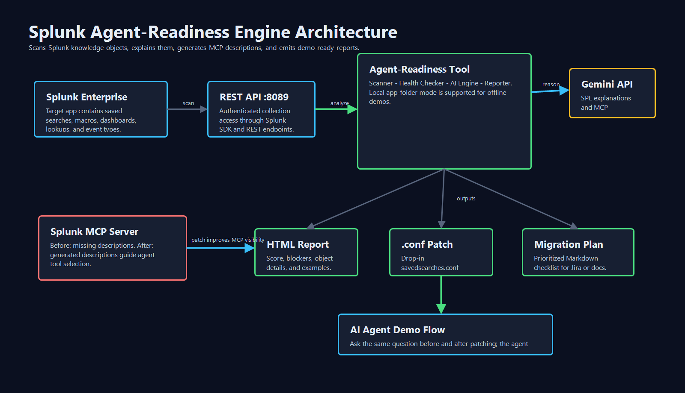

# Splunk Agent-Readiness Engine

> **1,700+ Splunk apps are invisible to AI agents. This tool makes them visible — in under 60 seconds.**

[](https://python.org)
[](https://splunkbase.splunk.com)
[](LICENSE)

---

## The Problem

Splunk just launched the **MCP Server** — a bridge that lets AI agents like Claude or GPT directly query Splunk knowledge objects. But here's the issue Splunk's own engineering blog called out:

> *"AI agents rely on semantic context to understand which tool to call. If your knowledge objects aren't descriptive, the agent is essentially flying blind."*

Every Splunk app ever built is missing the `description` field that makes it MCP-discoverable. There are **1,700+ apps on Splunkbase**. None of them were built for the AI era.

## What This Tool Does

**Four things, automatically:**

1. **🔬 Deep Scan** — reads every knowledge object in any Splunk app (saved searches, macros, dashboards, field extractions, lookups) via the REST API or local `.conf` files
2. **🏥 Health Report** — flags deprecated commands, hardcoded IPs, performance anti-patterns, missing MCP descriptions, and Classic XML dashboards
3. **🤖 AI Explanations** — uses Groq (Llama 3.3) to explain every search in plain English: what it reads, what it computes, who owns it, what business question it answers
4. **🔗 MCP Patch Generator** — writes the exact `description =` fields Splunk's MCP Server needs, packaged as a drop-in `.conf` file

### Before vs After

```ini
# BEFORE — AI agent is flying blind
[Brute Force - Failed Logins by User]
description =

# AFTER — Agent-ready in seconds
[Brute Force - Failed Logins by User]
description = Use when investigating brute-force or credential-stuffing attacks.
              Returns failed-login counts grouped by user and source IP from Linux
              auth logs. Trigger when failure count exceeds 10 per hour.
```

## Quick Start

```bash
# 1. Install dependencies
pip install -r requirements.txt

# 2. Configure (copy and fill in credentials)
cp config/config.yaml.example config/config.yaml

# 3. Run — offline demo mode (no Splunk needed)
python src/main.py --app DemoSecurityApp --app-path tests/mock_app --offline-ai

# 4. Run against live Splunk
python src/main.py --app SplunkSecurityEssentials

# 5. Or use the web UI
python src/server.py
# → open http://localhost:5000
```

## Demo Script (3 Minutes)

**0:00–0:30** — Show a live Splunk app with no descriptions. Open Claude with MCP Server connected. Ask it to "find failed logins." Watch it fail — it can't determine which saved search to use.

**0:30–1:00** — Run the tool:
```bash
python src/main.py --app SplunkSecurityEssentials
```
Show the terminal output: 40 searches scanned, 38 MCP blockers found, score: 12/100.

**1:00–1:45** — Open `output/report.html`. Show:
- Score: **12/100 → 88/100** after applying the patch
- Before/After MCP description cards (red → green)
- Deprecated dashboard warnings
- Health issues per search

**1:45–2:15** — Apply the patch:
```bash
cp output/agent_ready_patch.conf /opt/splunk/etc/apps/SplunkSecurityEssentials/default/
splunk restart
```
Ask Claude the same question. It now immediately calls the correct saved search.

**2:15–3:00** — Architecture slide. Impact statement: *1,700 apps × average 30 searches = 51,000 knowledge objects currently invisible to AI agents.*

## Architecture



```
┌─────────────────────────────────────────────────────────┐
│                    Splunk Enterprise                     │
│  ┌─────────────┐  ┌──────────┐  ┌──────────────────┐   │
│  │ Saved Search│  │  Macros  │  │    Dashboards    │   │
│  └──────┬──────┘  └────┬─────┘  └────────┬─────────┘   │
└─────────┼──────────────┼─────────────────┼─────────────┘
          │  REST API (port 8089)           │
          ▼                                ▼
┌─────────────────────────────────────────────────────────┐
│              Splunk Agent-Readiness Engine               │
│  ┌──────────┐  ┌──────────┐  ┌──────────┐  ┌────────┐  │
│  │ Scanner  │→ │  Health  │→ │ AI Engine│→ │ Scorer │  │
│  │(Module 1)│  │Checker(2)│  │(Module 3)│  │  (4)   │  │
│  └──────────┘  └──────────┘  └────┬─────┘  └───┬────┘  │
└─────────────────────────────────────────────────────────┘
                                     │               │
                                Groq API         Outputs:
                               (AI calls)     ┌──────────────┐
                                              │ report.html  │
                                              │ patch.conf   │
                                              │ migration.md │
                                              └──────────────┘
                                                    │
                                     ┌──────────────▼──────────────┐
                                     │     Splunk MCP Server       │
                                     │  (agents now find correct   │
                                     │   tools via descriptions)   │
                                     └─────────────────────────────┘
```

## Tech Stack

| Layer | Technology |
|---|---|
| Language | Python 3.11+ |
| Splunk connection | `splunk-sdk` + REST API (port 8089) |
| AI reasoning | Groq API (`llama-3.3-70b-versatile`) |
| Web UI | Flask + Server-Sent Events (live progress) |
| Report output | Jinja2 HTML + JSON + Markdown |
| `.conf` patching | Plain text generation (drop-in, zero-code) |

## Scoring Breakdown

Each knowledge object is scored 0–100:

| Dimension | Points | What it checks |
|---|---|---|
| MCP Description | 40 | Is there a description field ≥ 20 chars? |
| Data Activity | 20 | Does the search return data in last 30 days? |
| Health | 20 | No critical SPL errors or issues? |
| No Deprecated | 10 | No removed/deprecated commands? |
| No Hardcoded | 10 | No hardcoded hostnames/IPs? |

**Grade scale:** A (≥80) · B (≥60) · C (≥40) · D (≥20) · F (<20)

## Qualifying Prize Tracks

- **Platform / Developer Experience** — primary track: tooling that improves the Splunk development lifecycle
- **AI Innovation** — uses Groq (Llama 3.3) to automate documentation + semantic enrichment
- **Observability** — health scoring and deprecation detection serve monitoring/observability goals

## Impact

- **1,700+ apps** on Splunkbase affected today
- **51,000+ knowledge objects** currently invisible to AI agents (avg. 30 searches/app)
- **Used by 90 of the Fortune 100** — the installed Splunk base is the market
- **Zero-code fix**: drop a `.conf` file, restart, done

## File Structure

```
splunk-agent-readiness/
├── src/
│   ├── main.py              ← CLI entry point
│   ├── server.py            ← Flask web UI with live progress
│   ├── pipeline.py          ← Orchestration layer
│   ├── scanner/             ← Splunk REST + local .conf scanning
│   ├── health/              ← Deprecated/broken pattern detection
│   ├── ai/                  ← Groq/Llama 3.3 explainer + MCP generator + prompts
│   ├── scorer/              ← Agent-readiness scoring (0–100)
│   └── reporter/            ← HTML report + .conf patcher + migration plan
├── tests/mock_app/          ← 26-search Security Essentials replica for demos
├── config/config.yaml.example
└── output/                  ← Generated reports land here
```

## License

MIT
